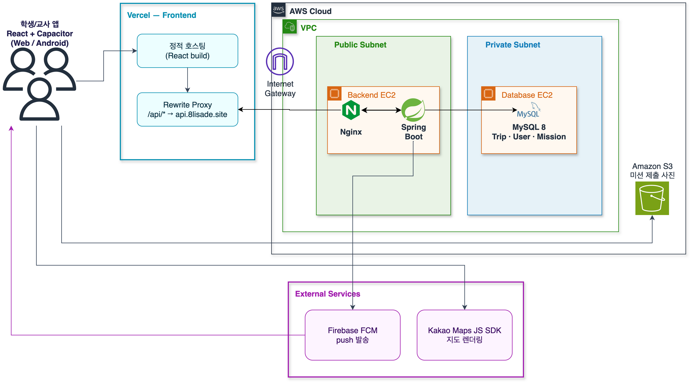
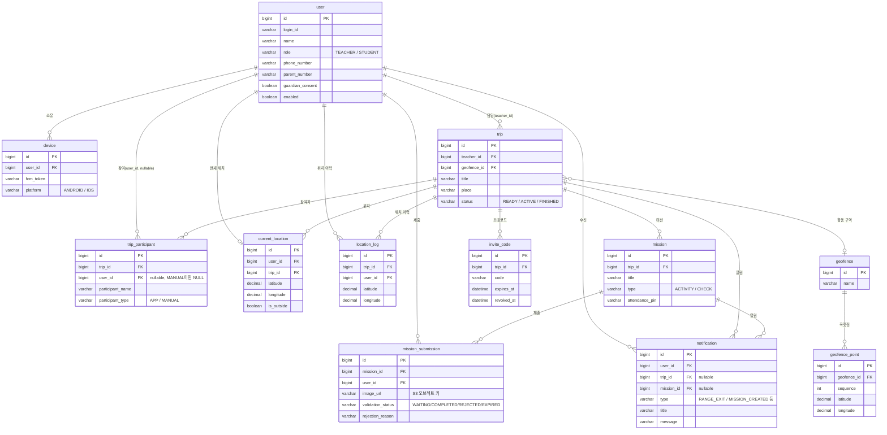

# 두리번

> "선생님 대신 두리번거릴게요"

현장체험학습 중 학생의 실시간 위치와 안전 구역 이탈 여부를 확인하고, 미션(사진 제출·점검 PIN)으로 일정 수행을 확인하는 학생·교사용 안전 관리 앱이다. 8LISADE 팀(softeer 8팀) 부트캠프 해커톤 프로젝트로 개발했다.

## 서비스 설명

교사는 현장체험학습(Trip)을 생성하고 활동 구역(안전 구역)을 지도에 직접 그린 뒤, 초대 코드로 학생을 참여시킨다. 학생 앱은 참여 중 약 10초 주기로 GPS 좌표를 서버에 전송하고, 서버는 좌표가 안전 구역(다각형 + 20m 오차 버퍼) 밖인지 판정한다. 안전 구역을 벗어난 상태가 일정 횟수 이상 이어지면 담당 교사에게 FCM push로 즉시 알림이 간다.

교사는 미션(활동 미션 = 사진 제출, 점검 미션 = 4자리 PIN 입력)을 등록해 학생이 정해진 장소·시간에 있는지 확인하고, 학생별 제출 현황을 대시보드에서 조회한다. 휴대폰이 없는 학생은 교사가 "직접 추가"로 등록해 위치 추적 없이 수동으로 상태를 체크할 수 있다.

- **학생**: 초대 코드로 Trip 참여 → 위치 자동 전송 → 미션 수행(사진/PIN)
- **교사**: Trip 생성/시작/종료 → 학생 명단·실시간 위치·안전 구역 이탈 현황 조회 → 미션 등록 및 제출 확인

## Tech Stack

### Frontend
- React 19 + TypeScript, Vite
- Capacitor (Android 앱 빌드, 카메라/푸시알림/위치 네이티브 연동)
- Kakao Maps JS SDK (안전 구역 지도, 실시간 위치 지도)
- Firebase (FCM 웹/앱 푸시 수신)
- Vitest + Testing Library (테스트)

### Backend
- Spring Boot 4 (Java 21)
- Spring Security (세션 기반 인증)
- Spring Data JPA + MySQL 8
- AWS S3 (미션 제출 사진 저장)
- Firebase Admin SDK (FCM 푸시 발송)

### Infra / CI-CD
- Frontend: Vercel (자동 배포, `/api/*` 요청은 Backend로 rewrite)
- Backend: GitHub Actions → GHCR(Docker 이미지 push) → EC2 SSH 배포 (`docker compose`)
- GitHub Actions: Frontend CI / Backend CI / Android CI / iOS CI

## 서비스 아키텍처

**흐름 요약**
1. 학생/교사 앱이 Vercel 정적 호스팅에서 React 번들을 받는다.
2. `/api/*` 요청은 `vercel.json`의 rewrite 규칙으로 `api.8lisade.site`(EC2, Public Subnet)에 HTTPS로 프록시된다. EC2의 Nginx가 TLS(Let's Encrypt)를 종료하고 `127.0.0.1:8080`의 Spring Boot 컨테이너로 넘긴다.
3. Backend는 Private Subnet의 MySQL에 Trip·User·Mission 등 도메인 데이터를 읽고 쓴다. 학생 위치는 주기적 POST로 저장되고, 교사 앱은 SSE(Server-Sent Events)로 실시간 위치를 구독한다.
4. 미션 제출 사진은 Backend가 발급한 presigned URL로 클라이언트가 S3에 직접 업로드하고(Backend가 파일을 릴레이하지 않음), Backend는 참조 키만 저장한다.
5. 안전 구역 이탈 감지 시 Backend가 Firebase Admin SDK로 담당 교사 기기에 FCM push를 발송한다.
6. 클라이언트는 FCM을 통해 push 알림을 수신한다. 안전 구역·실시간 위치 지도는 Kakao Maps JS SDK로 렌더링된다.
7. `main` push 시 GitHub Actions가 테스트 → Docker 이미지 빌드 → GHCR push 후, Public Subnet의 EC2에 SSH로 직접 접속(Bastion 없음)해 `docker compose up`으로 배포한다.

## ERD

## Known Issues

- **iOS 미지원**: Capacitor iOS 앱 빌드·배포에는 Apple Developer Program(유료) 가입이 필요해 이번 해커톤 범위에서는 지원하지 않는다. Android/Web만 지원한다.
- **웹 브라우저에서의 GPS 정확도 한계**: 웹은 Capacitor 네이티브 위치 API 대신 브라우저 Geolocation API를 쓰는데, 백그라운드(탭 비활성/화면 꺼짐) 상태에서 위치 수집이 제한되고 정확도도 기기·브라우저별로 편차가 커서 안전 구역 이탈 판정이 앱 대비 불안정할 수 있다.
- **학생/학부모 전화 걸기 버튼 비활성**: 교사용 학생 상세 화면에 전화 걸기 UI는 있지만, 참가자 조회 API 계약에 전화번호 필드 자체가 없어 실제 `tel:` 연결이나 번호 표시는 되지 않는다.
- **위치 이력 전체 조회 불가**: 위치 로그는 안전 구역 이탈 좌표만 적재하며, 학생의 전체 이동 경로(트랙) 조회 기능은 없다.
- **진행중/종료 상태 Trip 삭제 불가**: Trip 삭제는 `READY`(시작 전) 상태에서만 가능하다. 참가자·위치·미션 데이터가 쌓인 진행중/종료 Trip을 삭제하려면 해당 데이터까지 함께 정리하는 별도 구현이 필요해 지원하지 않는다.
- **Trip 종료 결과보고서/내보내기 기능 없음**: 체험학습 종료 후 참여 기록·미션 결과를 파일로 내보내거나 요약 리포트로 보는 기능은 구현하지 않았다.

## 개발자 조 구성원 정보

8LISADE (softeer 8팀)

| 이름 | GitHub | 역할 |
| --- | --- | --- |
| 김현문 | [@hyeonyway](https://github.com/hyeonyway) | Frontend 리드 · 인증/세션 · Trip 참여 및 미션 제출 플로우 · 배포 관리 |
| 김근성 | [@rootachieve](https://github.com/rootachieve) | 위치 추적(GPS/안전 구역 이탈 판정) · Android 백그라운드 위치 파이프라인 · 인프라 |
| 박민서 | [@minseo6753](https://github.com/minseo6753) | Backend 도메인 모델링(JPA) · 알림(Notification) · 실시간 위치 SSE |
| 임하민 | [@haimin13](https://github.com/haimin13) | FCM Push/SSE 연동 · 미션 관리 화면/API · CI/CD |
